<p align="center">
  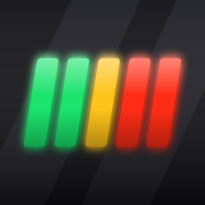
</p>

<h1 align="center">Apex Dash</h1>

<p align="center">
  <b>Your iPhone becomes the steering wheel display of your racing game.</b><br>
  Live gear, speed, rev lights, tyres and lap deltas — then study every lap in your browser.<br>
  Free, open source, no ads, no account, no tracking.
</p>

<p align="center">
  <a href="https://github.com/bekir1184/ApexDash/actions/workflows/ci.yml"></a>
  <a href="LICENSE"></a>
  
  
</p>

<p align="center">
  <a href="https://apps.apple.com/app/id6813199957"></a>
</p>

<p align="center">
  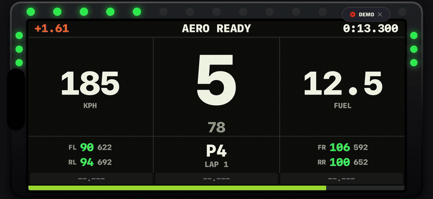
</p>

---

## What is this?

Racing games can send everything the car is doing — revs, gear, speed, tyre
temperatures, lap times — over your Wi-Fi network, 60 times a second. Apex Dash
listens to that and turns your phone into the display you would see on a real
steering wheel. Prop the phone up in front of you and drive.

When a lap finishes, it is saved with its full trace. Open the phone's address
in a browser and you get a proper telemetry page: track map coloured by speed,
speed and pedal charts, a lap-to-lap comparison and a corner by corner table.

**You need:** an iPhone or iPad, a racing game on the same Wi-Fi (PC, PlayStation
or Xbox), and two minutes of setup. No PC in the middle, no cloud, no account.

The app is free on the **[App Store](https://apps.apple.com/app/id6813199957)** —
no ads, no purchases. Everything you see here is what you get.

## Three steps

<table>
<tr>
<td width="55%">

**1. Open the app and read the address**

Settings › Connection shows your phone's IP address and the port. That screen
also lists exactly what to switch on in the game.

**2. Enter it in the game**

In F1 25 / F1 26: Settings › Telemetry. Turn UDP Telemetry **on**, Broadcast
Mode **off**, put your phone's IP in **UDP IP Address**, leave the port at
**20777** and send rate at **60 Hz**.

**3. Drive**

The dashboard comes alive as soon as you are on track. Swipe sideways to change
dashboard, tap the screen for a back button, pull down for the menu.

</td>
<td>

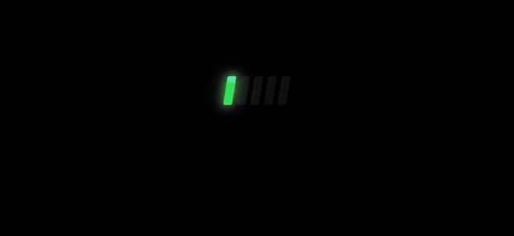

</td>
</tr>
</table>

> **No game handy?** Turn on **Settings › Demo drive**. A simulated car drives a
> lap for you, so you can see everything working before you touch the game.

## Six dashboards

Every layout draws the same live data. Pick the one you like in the menu.

| | |
| --- | --- |
| **Realistic** — a real wheel LCD in a bezel with rev LEDs and FIA flag lights | **Broadcast** — the TV graphics halo: speed dial, overtake, recharge and deploy |
| 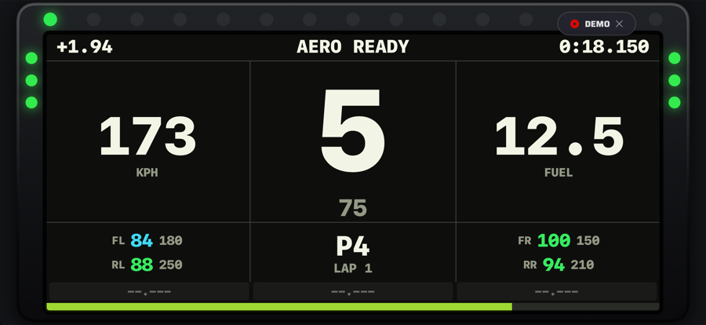 | 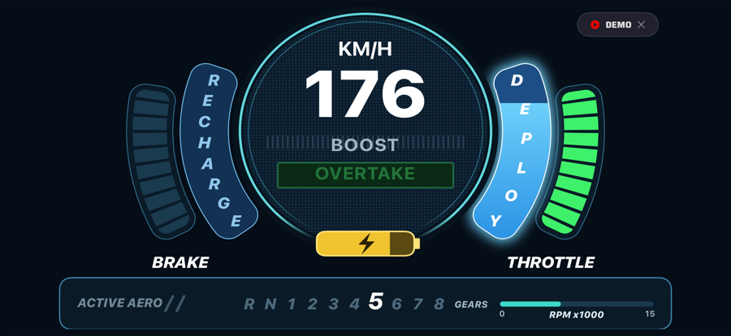 |
| **Dot Matrix** — a wheel LCD where every shape resolves into LED dots | **Modern** — clean and high contrast, in the style of a Bosch DDU |
| 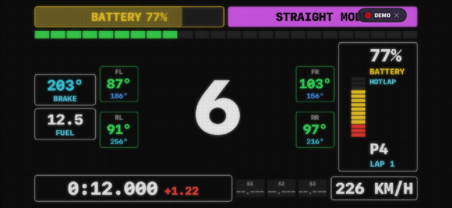 | 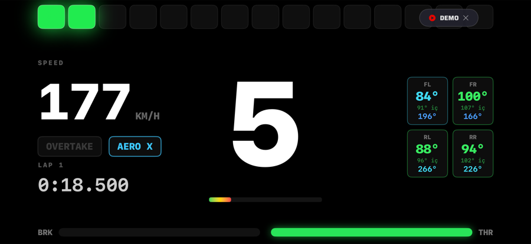 |
| **Game** — a copy of the in-game cockpit display | **Cluster** — three analogue dials in a machined metal housing |
| 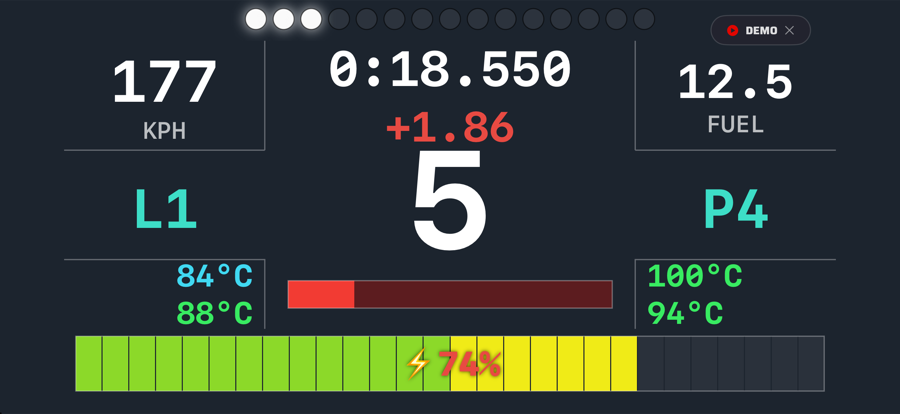 | 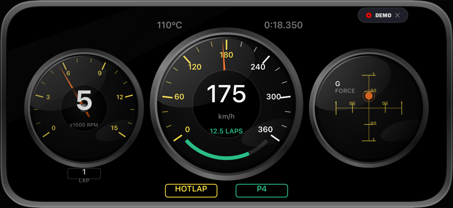 |

Shown where the layout allows: 15 LED rev strip with a shift flash (and an
optional flash of the phone's LED), gear, speed, RPM, throttle and brake, tyre
and brake temperatures, lap time, live delta to your best lap, gap to the car
ahead, sector times coloured purple, green or yellow, start lights, FIA flags,
invalid lap, pit limiter, and — depending on the game — overtake and active aero
or DRS.

## Study your laps in a browser

Every completed lap is recorded 20 times a second. Open it on a laptop or tablet
and look at where you actually lose time.

<p align="center">
  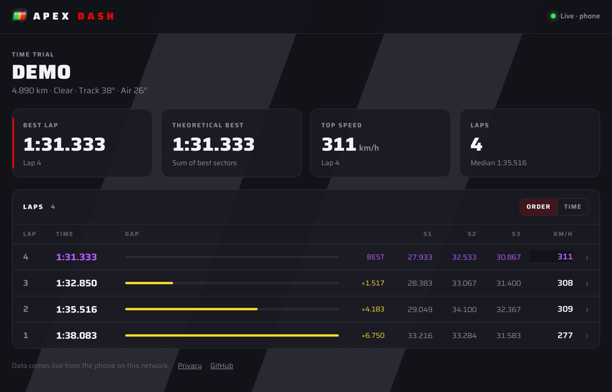
</p>

The session view answers the first questions: your best lap, the theoretical
best from your fastest sectors, your top speed, and every lap with its gap and
sector times. Tap a lap for the detail.

<p align="center">
  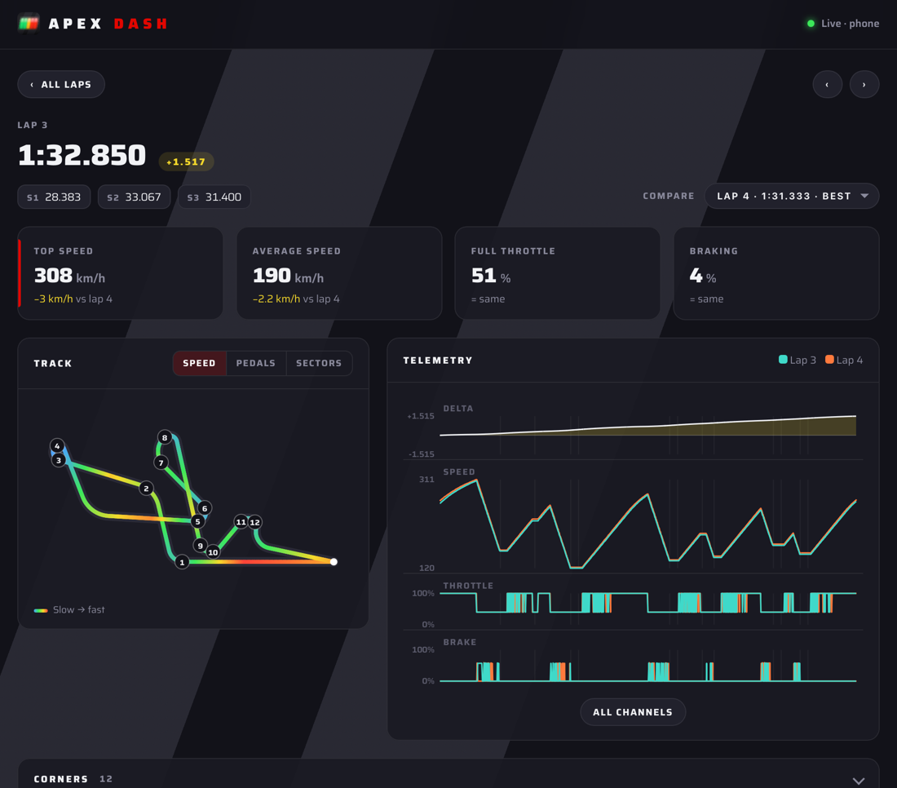
</p>

The lap view compares that lap with any other: a time delta that shows where the
gap grows, the track map coloured by speed, pedals or sectors, speed, throttle
and brake traces with a shared cursor, and a corner table with brake points,
entry, apex and exit speeds. "All channels" adds gear, steering, RPM, lateral G
and battery.

### Connecting the browser

<table>
<tr>
<td width="52%">

1. Open **[apexdash.pro](https://www.apexdash.pro)** on the computer.
2. In the app, open **Settings › Telemetry site** and tap **SCAN QR**.
3. The page hands you over to your phone, and laps appear as you drive.

You can also skip the QR: type the address shown in the app, for example
`http://192.168.1.20:8777`, into any browser on the same Wi-Fi.

The analysis page is served by the phone itself, so the laps never leave your
network. apexdash.pro is only used to find the phone.

</td>
<td>

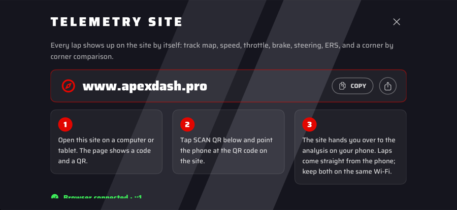

</td>
</tr>
</table>

The phone keeps a live lap list too, with sector colours and CSV export:

<p align="center">
  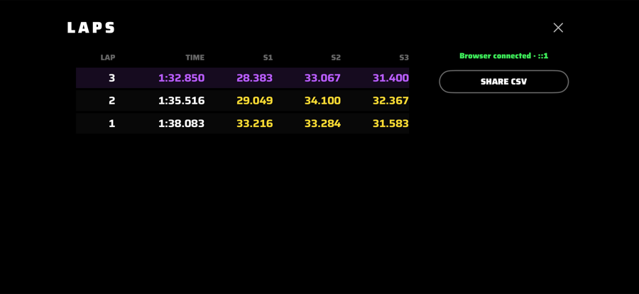
</p>

## Supported games

| Game | Platforms | In-game settings (Settings › Telemetry) |
| --- | --- | --- |
| EA SPORTS F1 26 | PC, PlayStation, Xbox | UDP Telemetry **On** · Broadcast Mode **Off** · IP Address **your phone's IP** · Port **20777** · Send Rate **60 Hz** · UDP Format **2026** · Your Telemetry **Public** |
| EA SPORTS F1 25 | PC, PlayStation, Xbox | The same, with UDP Format **2025**, and 2025 selected on the app's connection screen |

More games are welcome — see [Adding a game](docs/ADDING_A_GAME.md).

> **Why broadcast off?** iOS only receives broadcast traffic with a special
> Apple entitlement. Sending straight to the phone's address always works.
> Reserve that address in your router so it stops changing.

## Questions

**Does it cost anything?** No. There is no paid version, no advertising and
nothing to sign up for.

**Does it need a PC in between?** No. The game talks to the phone directly.

**Does it work with a console?** Yes. PlayStation and Xbox send the same UDP
telemetry.

**Can other people on the network see my laps?** Anyone on your own Wi-Fi who
opens the phone's address can see the current session. Nothing leaves the
network, and nothing is stored on a server.

**Are my laps saved?** They live in the phone's memory while the app is open,
and you can export them as CSV. Keeping them permanently is on the list.

**Which languages?** English and Turkish, following your phone. Adding a
language is one file — see [CONTRIBUTING.md](CONTRIBUTING.md).

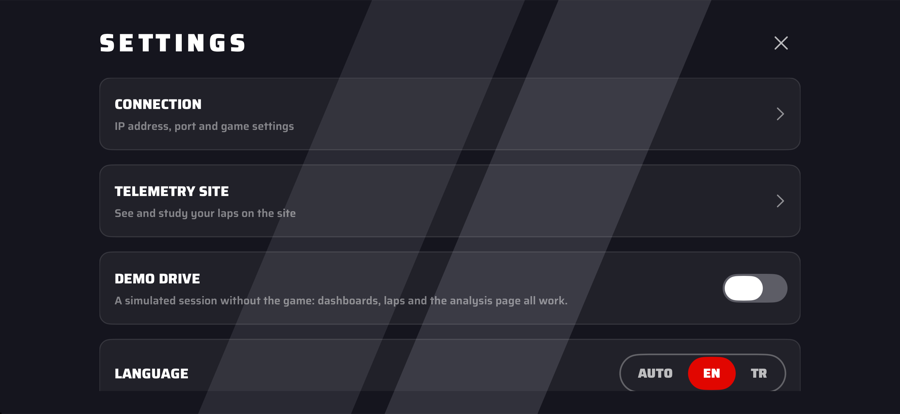

**Photosensitivity warning.** The shift warning flashes the screen quickly, and
can flash the phone's LED. The LED is **off by default**, and the warning is
shown before first use. If you are sensitive to flashing light, leave both off.

**Privacy.** Apex Dash collects nothing: no analytics, no accounts, no servers
of its own. See the [privacy policy](https://www.apexdash.pro/privacy).

<br clear="right">

## Contributing

New games, dashboards, translations and fixes are all welcome, whether you write
code or not: bug reports, screenshots of real wheel displays and translations
help just as much.

- [CONTRIBUTING.md](CONTRIBUTING.md) — build the app, find your way around
- [docs/ADDING_A_GAME.md](docs/ADDING_A_GAME.md) — add another racing game
- [.claude/skills/apex-dash/SKILL.md](.claude/skills/apex-dash/SKILL.md) — the
  architecture, the project's direction and the recipes in one file. It is a
  skill for AI coding assistants: clone the repo and Claude Code picks it up on
  its own, or hand the file to any other assistant.
- First pull request? A bot asks you to sign the [CLA](CLA.md) once.

```bash
brew install xcodegen && xcodegen generate && open ApexDash.xcodeproj
```

You do not need the game to develop: turn on the demo drive, or run
`python3 Tools/f1_sim.py 127.0.0.1`.

## F1 packet layout

Verified against EA's specifications *Data Output from F1 25* and the *2026
Season Pack Telemetry Output Structures*. The header is 29 bytes, little endian,
packed. Differences between the two games live in `PacketFormat` and are covered
by tests.

| Packet | F1 25 | F1 26 |
| --- | --- | --- |
| Cars per packet | 22 | 24 |
| Car Telemetry (6) | 60 B per car, DRS byte, 16-bit engine temp | 59 B per car, 8-bit engine temp |
| Car Status (7) | 55 B per car | 59 B per car, adds ERS harvest limit per lap |
| Lap Data (2) | 57 B per car | 57 B per car |
| Participants (4) | 57 B per car, 8-bit ids | 60 B per car, 16-bit ids |
| Motion (0) | 60 B per car, float G forces | 54 B per car, quantised G forces |
| Car Telemetry 2 (16) | not sent | 10 B per car: active aero, overtake |

## How this was built

This app was written with an AI coding assistant, which is why the commit log
carries `Co-Authored-By` lines. The design was drawn against reference frames,
the packet offsets were verified against EA's published specifications and real
sessions, and parsing, the demo drive and translations are covered by tests.

## Licence and trademarks

The source code is licensed under the [GNU General Public License v3](LICENSE).

The name **Apex Dash**, the logo and the app icon are not covered by that
licence. If you publish a fork, give it its own name and icon — see
[TRADEMARKS.md](TRADEMARKS.md).

The menus use [Saira](https://github.com/Omnibus-Type/Saira) by Omnibus-Type,
under the SIL Open Font License 1.1, included in `Resources/Fonts`.

Apex Dash is not affiliated with, endorsed by or connected to Formula One, the
FIA, Electronic Arts or Codemasters. F1 and Formula 1 are trademarks of Formula
One Licensing B.V., used only to say which games the app reads telemetry from.

<p align="center"><sub>Screenshots show the built-in demo drive.</sub></p>
