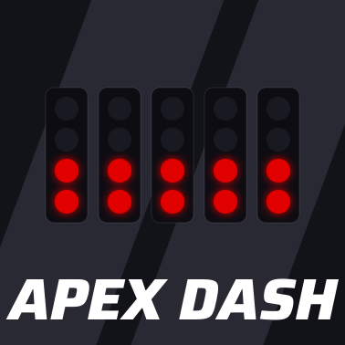

  

<h1 align="center">Apex Dash</h1>

  Turn your iPhone or iPad into a racing wheel display. 
  Free, open source, no ads, no account, no tracking.

  
  
  

---

Apex Dash listens to the telemetry your racing game sends over Wi-Fi and draws it
as a live dashboard: gear, speed, rev lights, tyres, ERS, lap delta, sectors and
flags. Every finished lap is recorded at 20 Hz, and you can study it in a
browser on the same network: track map, speed and pedal traces and a corner by
corner comparison.

No PC in the loop and no cloud. The data goes from the game to your phone, and
from your phone to your browser.

## Supported games

| Game | Platforms | In-game settings (Settings › Telemetry) |
| --- | --- | --- |
| EA SPORTS F1 26 | PC, PlayStation, Xbox | UDP Telemetry **On**, Broadcast Mode **Off**, IP Address **your phone's IP** (shown in the app), Port **20777**, Send Rate **60 Hz**, UDP Format **2026**, Your Telemetry **Public** |
| EA SPORTS F1 25 | PC, PlayStation, Xbox | Same, with UDP Format **2025**. Pick 2025 in the app's connection screen too. |

More games are welcome. See [Adding a game](docs/ADDING_A_GAME.md).

> **Why is broadcast off?** iOS only delivers broadcast traffic to apps with a
> special Apple entitlement. Sending straight to the phone's address works
> everywhere. Reserve that address in your router so it stops changing.

## Dashboards

Swipe between six layouts in the menu, tap one to go full screen, tap the screen
for a back button or pull down to return.

| Dashboard | Look |
| --- | --- |
| **Realistic** | A real wheel LCD inside a bezel with rev LEDs and FIA flag lights |
| **Broadcast** | The TV graphics halo: speed dial, overtake, recharge and deploy, pedals, gears |
| **Dot Matrix** | A wheel LCD where every shape resolves into LED dots |
| **Modern** | High contrast, clean layout in the style of a Bosch DDU |
| **Game** | The in-game cockpit display |
| **Cluster** | Three analogue dials in a machined metal housing |

Shown where the layout allows:

- 15 LED rev strip; the screen flashes at the shift point, and the phone's flash
  can blink in sync if you enable it
- Gear, speed, RPM, throttle and brake
- Tyre surface and inner temperatures, brake temperatures, colour coded
- Lap time, live delta to your best lap, gap to the car ahead, sector times
  coloured purple, green or yellow
- Start lights from the game's own events, FIA flags, invalid lap, pit limiter
- **F1 26:** overtake and active aero. **F1 25:** DRS.

## Lap analysis in your browser

1. Open [apexdash.pro](https://www.apexdash.pro) on a computer or tablet.
2. In the app, go to **Settings › Telemetry site** and scan the QR code.
3. The page moves to your phone and stays there. Laps appear as you finish them.

You can also type the address shown in the app, for example
`http://192.168.1.20:8777`, into any browser on the same Wi-Fi.

The analysis page is served by the phone itself. apexdash.pro is only used to
find the phone: the app announces its local address once, through
[ntfy.sh](https://ntfy.sh), on a topic named after the pairing code. Laps are
kept in memory on the phone and disappear when the app is closed.

## Try it without the game

Turn on **Settings › Demo drive**. A simulated session feeds the real decoder,
so dashboards, lap timing and the analysis page all work.

## Photosensitivity

The shift warning flashes the screen rapidly, and can flash the phone's LED.
The LED is **off by default**, and a warning is shown before first use. If you
are sensitive to flashing light, leave both off.

## Privacy

Apex Dash collects no data. It has no analytics, no accounts and no servers of
its own. Telemetry stays on your phone and your local network. See the
[privacy policy](https://www.apexdash.pro/privacy).

## Contributing

New games, dashboards, translations and fixes are welcome. Read
[CONTRIBUTING.md](CONTRIBUTING.md) to build the app, find your way around the
code and open a pull request. First-time contributors are asked to sign the
[Contributor License Agreement](CLA.md).

## F1 packet layout

Verified against EA's specifications *Data Output from F1 25* and the *2026
Season Pack Telemetry Output Structures*. The header is 29 bytes, little endian,
packed. Differences between the two games live in `PacketFormat` and are
covered by tests.

| Packet | F1 25 | F1 26 |
| --- | --- | --- |
| Cars per packet | 22 | 24 |
| Car Telemetry (6) | 60 B per car, DRS byte, 16-bit engine temp | 59 B per car, 8-bit engine temp |
| Car Status (7) | 55 B per car | 59 B per car, adds ERS harvest limit per lap |
| Lap Data (2) | 57 B per car | 57 B per car |
| Participants (4) | 57 B per car, 8-bit ids | 60 B per car, 16-bit ids |
| Motion (0) | 60 B per car, float G forces | 54 B per car, quantised G forces |
| Car Telemetry 2 (16) | not sent | 10 B per car: active aero, overtake |

## How this was built

This app was written with an AI coding assistant, which is why the commit log
carries `Co-Authored-By` lines. The design was drawn against reference frames,
the packet offsets were verified against EA's published specifications and real
sessions, and parsing, the demo drive and translations are covered by tests.

## Licence and trademarks

The source code is licensed under the [GNU General Public License v3](LICENSE).

The name **Apex Dash**, the logo and the app icon are not covered by that
licence. If you publish a fork, give it its own name and icon. See
[TRADEMARKS.md](TRADEMARKS.md).

The menus use [Saira](https://github.com/Omnibus-Type/Saira) by Omnibus-Type,
under the SIL Open Font License 1.1, included in `Resources/Fonts`.

Apex Dash is not affiliated with, endorsed by or connected to Formula One, the
FIA, Electronic Arts or Codemasters. F1 and Formula 1 are trademarks of Formula
One Licensing B.V., used only to say which games the app reads telemetry from.
